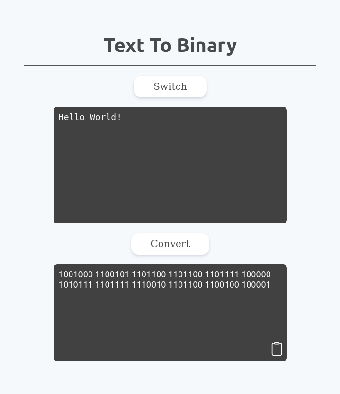

# Binary Decoder

In mathematics and in computing systems, a binary digit, or bit, is the smallest unit of data. Each bit has a single value of either 1 or 0, which means it can't take on any other value.

This simple project gives you the ability to convert a plain text into binary format and vice versa.

## Preview 

<p align="center"></p>

## Live Demo
```
http://meziounireda.me/Binary-Decoder/
```